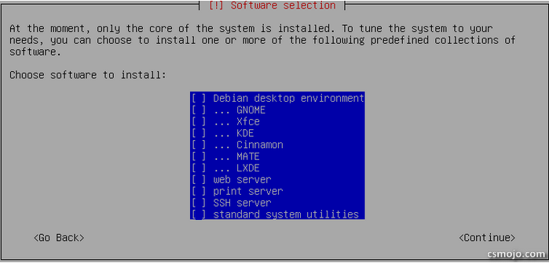
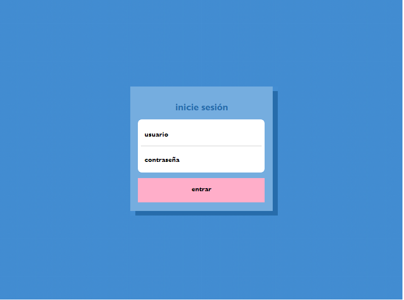
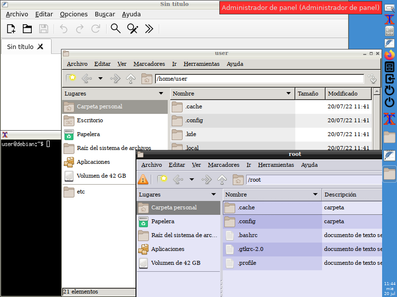

# linuxmin multimedia edition
## live/instalable para música
### Con personalización y utilidades para música, plugins vst/lv2 y samples sfz gratuitos esenciales y de calidad.
> - Componentes: Openbox, tint2, xterm, pcmanfm, featherpad, firefox, pcmanfm como root, wifi manager, botones cerrar sesión, reiniciar y apagar.
> - Personalización, temas y aspecto
> - Kernel RT y rtirq (rendimiento para audio)
> - jackdbus realtime y a2jmidid para ver los dispositivios alsamidi en jack
> - 2 modos en música: jack o reaper
> - jack -> carla: sfz (colección de soundfonts) o plugins
> - qjackctl (establecer tarjeta sonido) + carla
> - reaper -> plugins vst, lv2 (carla -> sfz), etc.
> - Plugins esenciales: 
>   - Instrumentos: Helm, Dexed, Monique, Surge XT, U-HE, TAL, Tunefish4
>   - Efectos: LSP, GVST, TAL, reaper
>   - Guitarra: Guitarix, Rakarrack
>   - Util: jack-keyboard (teclado virtual), Tonespace (acordes), hypercyclic (arpegiador), libreArp (arpegiador), Graillon (autotune), jackass (vst to jack)
> - Bancos sonido SFZ:
>   - Básicos (bateria + piano)
>   - Bajos  (sounds4u, FreeDrumKits, Roadstar, swagbass)
>   - Drumkits (Analogue drums, AVL, Ken, G&S, Rogers)
>   - GM (FluidR3)
>   - Guitarras (emilyguitar, Guitar DI, GuitarChord, sounds4u, LP-SGC)
>   - Percusión (AVL, Black Swamp Tambourine, Reactor)
>   - Pianos (sound4u: Yamaha C5, dynamic, dark, mellow, bright, classic, etc)
>   - Virtual Playing Orchestra 3
> - Impulse responses (lsp-plugin, reareverb)
> - Botones utiles barra derecha: alsamixer, Pulseaudio (on/off), Panic (restablecer jack)

Aquí puedes descargar el live/instalador: [linuxmin11_me.iso](https://upvedues-my.sharepoint.com/:u:/g/personal/jmpolo_upv_edu_es/EZomlrYHznVMvvKTy_Z9osYBLEXiul1kS0p-VoJcvfC2tA?e=fdIuY3)

(*usuario*: **user**, *contraseña* **live**) 

.png)
.png)
.png)
.png)
.png)
#
#
#
#
#

# linuxmin (básico)
## Instalación debian 11 + personalización básica de escritorio: Linux Mínimo
Aquí puedes descargar el live/instalador: [linuxmin11.iso](https://upvedues-my.sharepoint.com/:u:/g/personal/jmpolo_upv_edu_es/ERsrS4EyBOJPnoxN9eGnnPYBA4j9h7gMB8WVwNz5GiFdBA?e=NXMcMz)

(*usuario*: **user**, *contraseña* **live**) 

## si no hacer lo siguiente.... (obsoleto)

Instalar Debian 11 firmware version [aquí](https://cdimage.debian.org/cdimage/unofficial/non-free/cd-including-firmware/current/amd64/iso-cd/)

NO instalar ningún paquete

[Configurar la wifi o continuar en el punto siguiente para cable](http://phmmusic.blogspot.com/2022/05/debian-11-basico.html)

sudo apt update && sudo apt upgrade -y

sudo apt install git

git clone https://github.com/libertyrock/linuxmin

cd linuxmin

chmod +x ./instal

./instal

## Teclas

Windows + T XTerm (Terminal)

Windows + F Firefox (Navegador de internet)

Windows + e pcmanfm (Explorador de ficheros)

## Tamaño imagen

2,3 GB

## Contenido

bash-completion git

xserver-xorg-core openbox xinit slim tint2

pcmanfm featherpad feh xarchiver firefox-esr-l10n-es-es

## Pantallazos

