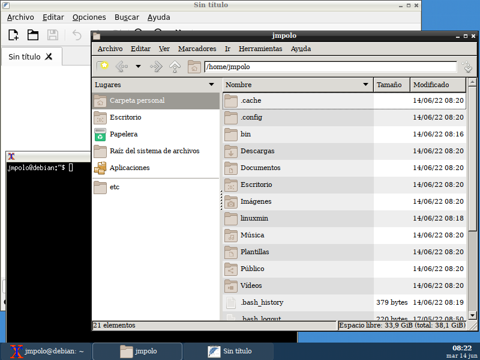

# linuxmin

Instalar Debian 11 firmware version [Aquí](https://cdimage.debian.org/cdimage/unofficial/non-free/cd-including-firmware/current/amd64/iso-cd/)

sudo apt update && sudo apt upgrade -y

sudo apt install git

git clone https://github.com/libertyrock/linuxmin

cd linuxmin

chmod +x ./instal

./instal

## Pantallazos

## Teclas

Windows + T Terminal

Windows + F Firefox

Windows + e pcmanfm
